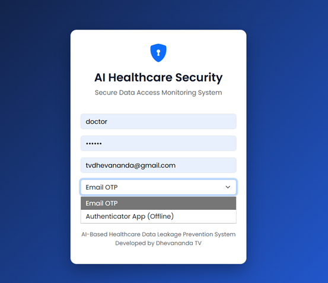
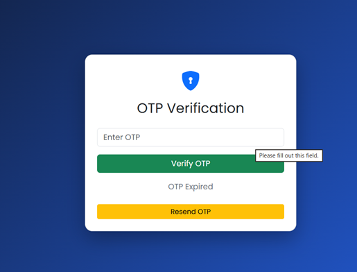
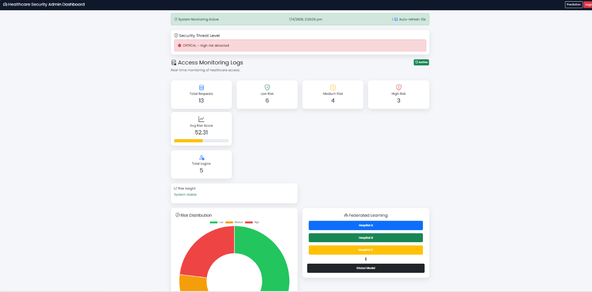
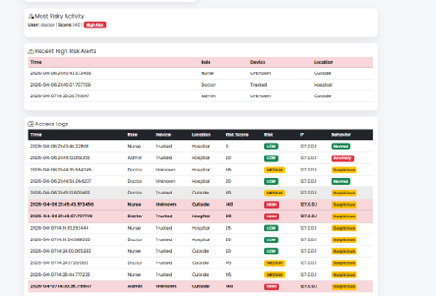
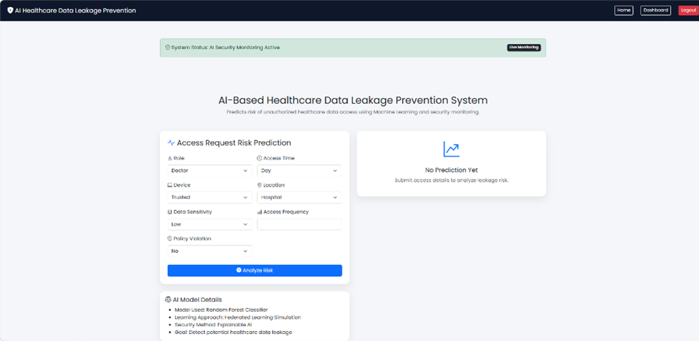

# 🏥 Healthcare Data Leakage Prevention System

An AI-based web application that detects and prevents sensitive healthcare data leakage using anomaly detection and secure authentication mechanisms.

## 🚀 Features

* 🔐 Login system with OTP & TOTP authentication
* 🤖 Anomaly detection using Isolation Forest
* 📊 Risk score calculation for user behavior
* 📧 Email alerts for suspicious activity
* 🔊 Alarm system for high-risk access

## 🛠️ Tech Stack

* Python (Flask)
* Machine Learning (Isolation Forest, Random Forest)
* NumPy, Pandas, Scikit-learn
* HTML, CSS, Bootstrap

## 📂 Project Structure

* templates/ → HTML pages
* static/ → CSS, images, audio
* model/ → ML model files
* app.py → Main application

## ⚙️ How to Run

1. Install dependencies
   pip install -r requirements.txt

2. Run the app
   python app.py

3. Open browser
   http://127.0.0.1:5000

## 📸 Screenshots

### 🔐 Login Page

### 🔢 OTP Verification

### 📊 Dashboard

### 🏠 Home Page

## 💡 Future Improvements

* Real-time hospital integration
* Advanced AI threat prediction
* Cloud deployment

## 👩‍💻 Author

Dhevananda TV
